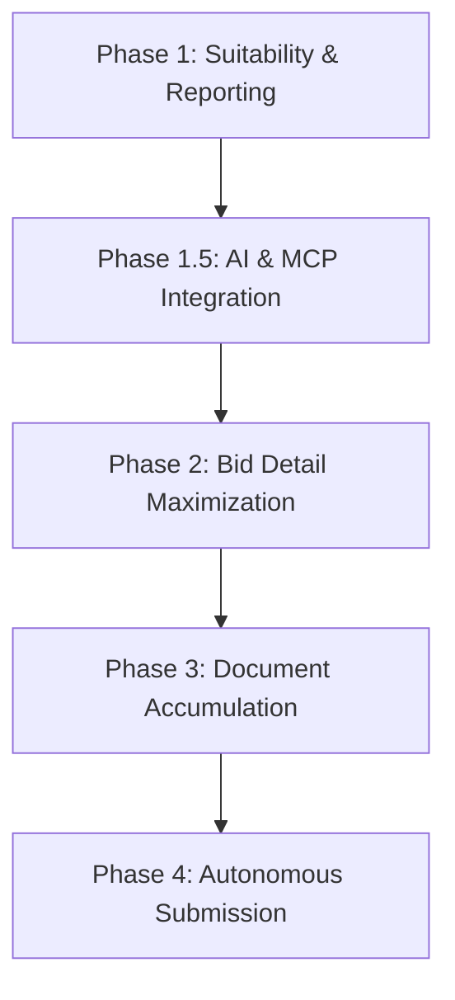

# TenderTracker Automation Roadmap

This document outlines the multi-phase roadmap to build an autonomous Government of India (GeM) tender processing tool. Our end goal is to have a system that checks, enriches, accumulates docs for, fills, and submits tenders autonomously.

---

## 🗺️ High-Level Roadmap Overview

---

## 📋 Detailed Phases

### 🔍 Phase 1: Tender Suitability Analysis & Reporting
*Filter and identify compatible tenders from incoming lists based on company profile parameters.*

- **1.1 Company Profile Configuration**
  - Define user qualifications (experience in years, annual turnover, location, certificates).
  - Define operational categories (e.g., Electric Motors, Cables, Industrial Gases).
  - Define financial parameters (max EMD limit, maximum tender value).
  - Define exemption status (MSE preference, Startup relaxation).
- **1.2 Compatibility Scorecard Engine**
  - Build logic to score incoming tenders against the company profile.
  - Grade compatibility (e.g., "100% Match", "Disqualified - Experience Insufficient").
- **1.3 Automated Reporting**
  - Generate comprehensive reports (Excel, HTML, Markdown) listing suitable vs. unsuitable tenders with explicit reasons for rejection/acceptance.

### 🤖 Phase 1.5: AI and MCP Integration (Completed)
*Use LLMs to make suitability checks more intelligent and expose the system via Model Context Protocol (MCP).*

- **1.5.1 LLM-based Intelligent Suitability Checker**
  - Develop prompt templates that evaluate raw tender text blocks or PDF content against the **Company Profile**.
  - Let the LLM predict `is_want_derived` and supply clear structured reasoning explaining its decision.
- **1.5.2 MCP Server Capabilities Expansion**
  - Implement MCP tools for listing, searching, parsing, and updating tenders.
  - Expose suitability evaluation logic as a tool to allow AI agents to run checking pipelines.
  - Provide RAG features (retrieving similar past category mappings) for improved extraction accuracy.
- **1.5.3 Dynamic Preference Mapping**
  - Implement active learning so that user adjustments to categories or tags dynamically update the LLM context or database value mappings.

### ⚡ Phase 2: Bid Detail Maximization from Minimal Inputs (Completed)
*Automatically crawl the portal and download documents with minimal starting inputs (e.g., Bid No or URL).*

- **2.1 Enhanced Selenium Detail Scraping**
  - Refine headless Selenium scraping to navigate GeM search pages and extract the bid information page.
  - Download official bid PDFs to local cache directories.
- **2.2 PDF Parsing and Information Extraction**
  - Extract structured parameters (consignee details, technical criteria, standard terms) from downloaded PDFs using advanced text parsing and LLM chunk analysis.
- **2.3 Database Enrichment**
  - Automatically save all extracted data to the SQLite database and update the vector index for semantic search.

### 📁 Phase 3: Tender-Specific Document Accumulation (Current Phase)
*Given a target tender, extract the required compliance documents list and organize files.*

- **3.1 Compliance Requirements Extraction**
  - Parse tender documents using LLMs to list all requested documentation (e.g., "MII Declaration", "OEM Authorization Form", "MSE Certificate", "Experience Details").
- **3.2 Document Mapping and Retrieval**
  - Map required files to the user's local document repository (credentials store).
  - Generate a checklist of missing or expired documents.
- **3.3 Document Template Generation**
  - Generate populated template files (e.g., bidder undertakings, cover letters) with bid-specific details pre-filled.

### 💰 Phase 4: Autonomous Tender Filling and Submission
*Autonomously log in, fill forms, upload compliance documents, and prepare the bid on GeM.*

- **4.1 Browser Automation for Portal Navigation**
  - Playwright/Selenium flow to automate GeM login (supporting secure token storage and human-in-the-loop MFA/OTP entry).
- **4.2 Form Autofill Engine**
  - Automate keying of technical and commercial specifications.
  - Inject calculated pricing parameters based on profit margin guidelines.
- **4.3 Secure Document Uploading**
  - Locate and upload the accumulated PDFs into correct slots in the bid submission portal.
- **4.4 Human-in-the-Loop Review**
  - Pause before final submission/signature, presenting a summary screen to the user to review and finalize.
- **4.5 Receipt Capture**
  - Capture and log submission receipts and bid acknowledgment IDs.
