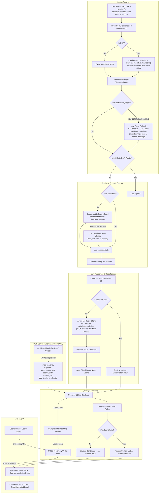
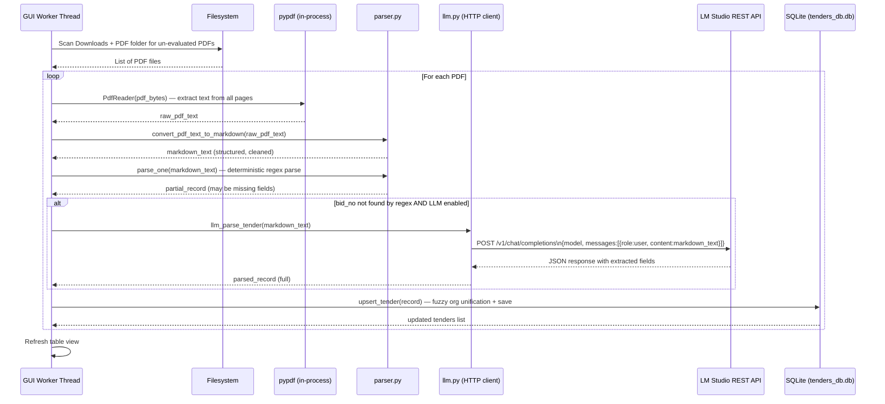

# GeM Tender Tracker

A modular, high-performance desktop application built in Python (Tkinter) to parse, scrape, and catalog Government of India (GeM) Tenders. The app supports parsing copy-pasted web text, crawling detail pages via Selenium, and extracting data from local GeM Bidding PDF files.

---

### Key Features

* **Sleek Custom Desktop UI**: Modern dark-themed dashboard with HSL panels, interactive data tables (Treeview), styled progress meters, and dynamic action logs (featuring Table, Calendar, Analytics, and Kanban Board Views).
* **Hybrid SQL + Vector DB Search**: SQLite metadata combined with an in-memory FAISS vector index, allowing real-time semantic query searches across tenders (e.g., finding relevant bids based on conceptual descriptions). Also powers the **Semantic RAG (Retrieval-Augmented Generation) engine** to retrieve and supply the LLM with highly relevant, historically verified few-shot examples during parsing and category mapping.
* **Interactive Human Comments & RAG Feedback Loop**: Allows users to attach custom notes/guidelines to any tender. Comments are automatically appended to the tender's semantic embedding text (to improve vector query matching) and supplied in few-shot LLM examples, enabling the AI to learn directly from past human corrections. Additionally, the app features an **Active Learning Subsystem** that scans comments (e.g. `this should map organization to X`), automatically updates database fields, and registers global keyword-to-value mapping rules to settings.
* **Automated Filing Process Progress Bar**: Displays a beautiful step-by-step progress bar and real-time status message in the loading dialog as it runs through the 10 stages of the tender filing workflow (PDF downloading, text parsing, AI document matching, copy validation, etc.).
* **Local LLM Auto-Loading & Async Reasoning**: Auto-loads local models on-demand in LM Studio (`/api/v1/models/load`) or pulls models in Ollama (`/api/pull`) when needed, running asynchronous evaluations using pooled HTTP connections.
* **Deterministic Parsing & Cleaning Layer**: Removed all LLM fallbacks from the extraction phase. A strictly Python-based regex and string cleaning layer strips page headers, footers, navigation, and GeM boilerplate to maximize parsing speed and accuracy.
* **Structured JSON Output & Pydantic Validation**: All LLM reasoning and classification outputs are forced to match a strict JSON schema and validated in-app using Pydantic models.
* **Zero-Duplicate LLM Response Caching**: Computes a stable SHA-256 hash of each tender metadata object. Cached classifications are retrieved instantly from the SQLite cache table, preventing redundant local LLM calls.
* **SQLite Database Backend**: Self-healing SQLite3 database (`tenders_db.db`) using the optimized `"bids"` table, classifications metadata, products lists, and profile tables with indices on unique fields (`bid_no`, `dept`, `category`, `end_date`).
* **Concurrent Ingestion Engine**: Parallel pipelines using `ThreadPoolExecutor` and async task batching (max 10 bids concurrently using `asyncio.gather`) to optimize performance on local AMD/Intel/Radeon hardware.
* **Advanced Logical Rules Filter**: Advanced boolean matching (`AND`, `OR`, `NOT` grouping with parentheses) and regular expressions prefixed with `rx:` to refine "Want" alerts.
* **Custom Toast Alerts**: Border-accented bottom-right notifications that fade out smoothly via alpha blending when new matching tenders are parsed or when crawls complete.
* **Tags System & Multi-Tag Selection**: A custom-made tags manager allows defining, deleting, and assigning multiple color-coded tag labels to tenders.
* **Export & Copy Table**: Export formatted Excel spreadsheets (e.g. `Tenders_FY_2026-27.xlsx`) or copy table selections directly to the clipboard in tab-separated (TSV) values.

---

## Application Flow Diagram

Below is the high-level workflow showing how inputs are processed, parsed, filtered, stored, and displayed within the application:



---

## PDF Processing Flow

When **Process Local PDFs** is clicked (or a PDF path is pasted), the app runs the following pipeline entirely within the Python process — **LM Studio is called directly via plain HTTP**, not via MCP:



### Step-by-Step Breakdown

| Step | Module | What Happens |
|------|--------|--------------|
| 1. Scan folders | `gui_workers.py` | Moves new PDFs from Downloads → PDF folder; lists un-evaluated files |
| 2. Extract text | `pypdf.PdfReader` | In-memory byte read; concatenates text from every page |
| 3. Convert to markdown | `parser.convert_pdf_text_to_markdown()` | Strips GeM boilerplate, formats key–value pairs into a clean text block |
| 4. Deterministic parse | `parser.parse_one()` | Regex patterns extract `bid_no`, `est_value`, `end_date`, etc. without any LLM call |
| 5. LLM fallback (if needed) | `llm.llm_parse_tender()` | Only invoked when regex fails to find a valid Bid Number. Sends the markdown text as a chat message directly to LM Studio via `HTTP POST /v1/chat/completions` |
| 6. Model auto-load | `llm._auto_load_local_model_impl()` | Before the first call, checks `/v1/models`; if not loaded, tries `POST /api/v1/models/load` with up to 3 body variants (400 errors are caught and retried) |
| 7. Upsert to DB | `db.upsert_tender()` | Fuzzy org-name unification, value-mapping rules applied, then saved to SQLite |
| 8. UI refresh | `gui_table_tab.py` | Treeview reloaded; toast shown if tender matches Want rules |

> **Note:** LM Studio is called by the app's own `llm.py` HTTP client, **not** via the MCP server.
> The MCP server (`mcp_server.py`) is a separate entry point for external AI clients (Claude Desktop, Cursor, etc.)
> and is never invoked during the internal PDF processing pipeline.

---

## Directory Structure

```text
tenderTracker/
├── .github/workflows/
│   └── build.yml               # GitHub Actions CI build & release pipeline
├── .git/hooks/
│   └── pre-commit              # Local git hook running unit tests
├── src/                        # Application source modules
│   ├── core/                   # Core business logic and database models
│   │   ├── config.py           # Theme styles, fonts, and Treeview layout
│   │   ├── db.py               # SQLite database mapping and settings management
│   │   ├── excel.py            # Financial year and Excel workbook helpers
│   │   ├── geocode.py          # Location lookup helpers
│   │   ├── llm.py              # LLM connectivity, auto-loading, and RAG logic
│   │   ├── llm_client.py       # Async LM Studio client, Pydantic schema, and caching
│   │   ├── logger.py           # Logging configuration
│   │   ├── parser.py           # Clipboard block and PDF parsing logic
│   │   ├── scraper.py          # Selenium webdriver crawler logic
│   │   └── vector_search.py    # FAISS Vector Indexing & Semantic Search
│   └── gui/                    # Desktop UI windows and tabs
│       ├── app_gui.py          # Main UI launcher configuration
│       ├── gui_analytics.py    # Responsive analytics and charts
│       ├── gui_calendar.py     # Hover-animated calendar
│       ├── gui_dialogs.py      # Popup dialog configurations (rules, tags)
│       ├── gui_kanban.py       # Board / Kanban tab
│       ├── gui_table_tab.py    # Main table dashboard tab
│       └── gui_workers.py      # Background scraping and parsing workers
├── tests/                      # Core test suites
│   ├── test_db.py
│   ├── test_download.py
│   ├── test_excel.py
│   ├── test_filter.py
│   ├── test_llm.py
│   ├── test_parser.py
│   ├── test_perf_refactor.py   # Async caching, batching, and parsing unit tests
│   ├── test_value_mappings.py
│   └── test_vector_search.py   # FAISS semantic search unit tests
├── sample/
│   └── GeM-Bidding-9520877.pdf   # Sample GeM bidding PDF for testing
├── build.py                    # Build, dependency checks, and PyInstaller builder script
├── main.py                     # Entry point launcher script
├── requirements.txt            # Third-party Python dependencies
└── README.md                   # Project documentation
```

---

## Setup & Running Locally

### Prerequisites
* Python 3.11+
* Google Chrome (required for the Selenium detail crawler)

### Installation
1. Clone the repository and navigate to the project directory:
   ```bash
   cd tenderTracker
   ```
2. Create and activate a Python virtual environment:
   ```bash
   python -m venv .venv
   .venv\Scripts\activate
   ```
3. Install the dependencies:
   ```bash
   pip install -r requirements.txt
   ```

### Run the App
```bash
python main.py
```

### Run Unit Tests
```bash
python -m unittest discover tests
```

---

## Standalone Executable Compilation

To compile a standalone, self-signed Windows executable (`TenderTracker.exe`) with pre-commit validation and FAISS / Selenium resource bundling:

```bash
python build.py
```

The compiled binary will be located inside the `dist/` directory.

---

## Usage Guide

1. **Launch the App**: Open `TenderTracker.exe` (or run `python main.py`).
2. **Configure Save Location**: Click **Browse** at the top to select your preferred directory for saving the Excel sheets.
3. **Parse Tenders**:
   * **Option A**: Copy a GeM bidding block from the website and paste it into the textbox.
   * **Option B**: Copy the path to a local GeM Bidding PDF file (e.g., `sample\GeM-Bidding-9520877.pdf`) and paste it into the textbox.
   * Click **1. Parse Blocks**.
4. **Scrape Web Details (Optional)**: Select one or more rows in the table and click **2. Fetch Details (Selenium)** to fetch missing organizational or buyer metadata.
5. **Save to Excel**: Click **Save Selected to Excel** to log them into your local spreadsheet workbook.
