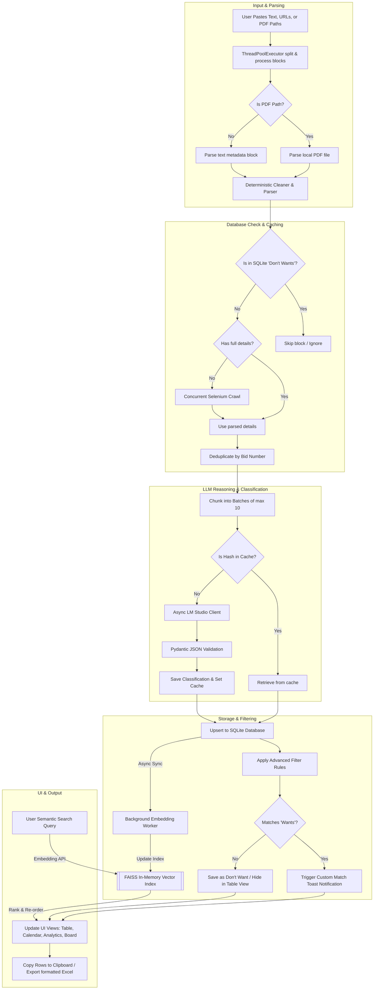

# GeM Tender Tracker

A modular, high-performance desktop application built in Python (Tkinter) to parse, scrape, and catalog Government of India (GeM) Tenders. The app supports parsing copy-pasted web text, crawling detail pages via Selenium, and extracting data from local GeM Bidding PDF files.

---

### Key Features

* **Sleek Custom Desktop UI**: Modern dark-themed dashboard with HSL panels, interactive data tables (Treeview), styled progress meters, and dynamic action logs (featuring Table, Calendar, Analytics, and Kanban Board Views).
* **Hybrid SQL + Vector DB Search**: SQLite metadata combined with an in-memory FAISS vector index, allowing real-time semantic query searches across tenders (e.g., finding relevant bids based on conceptual descriptions).
* **Local LLM Auto-Loading & Async Reasoning**: Auto-loads local models on-demand in LM Studio (`/api/v1/models/load`) or pulls models in Ollama (`/api/pull`) when needed, running asynchronous evaluations using pooled HTTP connections.
* **Deterministic Parsing & Cleaning Layer**: Removed all LLM fallbacks from the extraction phase. A strictly Python-based regex and string cleaning layer strips page headers, footers, navigation, and GeM boilerplate to maximize parsing speed and accuracy.
* **Structured JSON Output & Pydantic Validation**: All LLM reasoning and classification outputs are forced to match a strict JSON schema and validated in-app using Pydantic models.
* **Zero-Duplicate LLM Response Caching**: Computes a stable SHA-256 hash of each tender metadata object. Cached classifications are retrieved instantly from the SQLite cache table, preventing redundant local LLM calls.
* **SQLite Database Backend**: Self-healing SQLite3 database (`tenders_db.db`) using the optimized `"bids"` table, classifications metadata, products lists, and profile tables with indices on unique fields (`bid_no`, `dept`, `category`, `end_date`).
* **Concurrent Ingestion Engine**: Parallel pipelines using `ThreadPoolExecutor` and async task batching (max 10 bids concurrently using `asyncio.gather`) to optimize performance on local AMD/Intel/Radeon hardware.
* **Advanced Logical Rules Filter**: Advanced boolean matching (`AND`, `OR`, `NOT` grouping with parentheses) and regular expressions prefixed with `rx:` to refine "Want" alerts.
* **Custom Toast Alerts**: Border-accented bottom-right notifications that fade out smoothly via alpha blending when new matching tenders are parsed or when crawls complete.
* **Tags System & Multi-Tag Selection**: A custom-made tags manager allows defining, deleting, and assigning multiple color-coded tag labels to tenders.
* **Export & Copy Table**: Export formatted Excel spreadsheets (e.g. `Tenders_FY_2026-27.xlsx`) or copy table selections directly to the clipboard in tab-separated (TSV) values.

---

## Application Flow Diagram

Below is the workflow showing how inputs are processed, parsed, filtered, stored, and displayed within the application:



---

## Directory Structure

```text
tenderTracker/
├── .github/workflows/
│   └── build.yml               # GitHub Actions CI build & release pipeline
├── .git/hooks/
│   └── pre-commit              # Local git hook running unit tests
├── src/                        # Application source modules
│   ├── core/                   # Core business logic and database models
│   │   ├── config.py           # Theme styles, fonts, and Treeview layout
│   │   ├── db.py               # SQLite database mapping and settings management
│   │   ├── excel.py            # Financial year and Excel workbook helpers
│   │   ├── geocode.py          # Location lookup helpers
│   │   ├── llm.py              # LLM connectivity, auto-loading, and RAG logic
│   │   ├── llm_client.py       # Async LM Studio client, Pydantic schema, and caching
│   │   ├── logger.py           # Logging configuration
│   │   ├── parser.py           # Clipboard block and PDF parsing logic
│   │   ├── scraper.py          # Selenium webdriver crawler logic
│   │   └── vector_search.py    # FAISS Vector Indexing & Semantic Search
│   └── gui/                    # Desktop UI windows and tabs
│       ├── app_gui.py          # Main UI launcher configuration
│       ├── gui_analytics.py    # Responsive analytics and charts
│       ├── gui_calendar.py     # Hover-animated calendar
│       ├── gui_dialogs.py      # Popup dialog configurations (rules, tags)
│       ├── gui_kanban.py       # Board / Kanban tab
│       ├── gui_table_tab.py    # Main table dashboard tab
│       └── gui_workers.py      # Background scraping and parsing workers
├── tests/                      # Core test suites
│   ├── test_db.py
│   ├── test_download.py
│   ├── test_excel.py
│   ├── test_filter.py
│   ├── test_llm.py
│   ├── test_parser.py
│   ├── test_perf_refactor.py   # Async caching, batching, and parsing unit tests
│   ├── test_value_mappings.py
│   └── test_vector_search.py   # FAISS semantic search unit tests
├── sample/
│   └── GeM-Bidding-9520877.pdf   # Sample GeM bidding PDF for testing
├── build.py                    # Build, dependency checks, and PyInstaller builder script
├── main.py                     # Entry point launcher script
├── requirements.txt            # Third-party Python dependencies
└── README.md                   # Project documentation
```

---

## Setup & Running Locally

### Prerequisites
* Python 3.11+
* Google Chrome (required for the Selenium detail crawler)

### Installation
1. Clone the repository and navigate to the project directory:
   ```bash
   cd tenderTracker
   ```
2. Create and activate a Python virtual environment:
   ```bash
   python -m venv .venv
   .venv\Scripts\activate
   ```
3. Install the dependencies:
   ```bash
   pip install -r requirements.txt
   ```

### Run the App
```bash
python main.py
```

### Run Unit Tests
```bash
python -m unittest discover tests
```

---

## Standalone Executable Compilation

To compile a standalone, self-signed Windows executable (`TenderTracker.exe`) with pre-commit validation and FAISS / Selenium resource bundling:

```bash
python build.py
```

The compiled binary will be located inside the `dist/` directory.

---

## Usage Guide

1. **Launch the App**: Open `TenderTracker.exe` (or run `python main.py`).
2. **Configure Save Location**: Click **Browse** at the top to select your preferred directory for saving the Excel sheets.
3. **Parse Tenders**:
   * **Option A**: Copy a GeM bidding block from the website and paste it into the textbox.
   * **Option B**: Copy the path to a local GeM Bidding PDF file (e.g., `sample\GeM-Bidding-9520877.pdf`) and paste it into the textbox.
   * Click **1. Parse Blocks**.
4. **Scrape Web Details (Optional)**: Select one or more rows in the table and click **2. Fetch Details (Selenium)** to fetch missing organizational or buyer metadata.
5. **Save to Excel**: Click **Save Selected to Excel** to log them into your local spreadsheet workbook.
